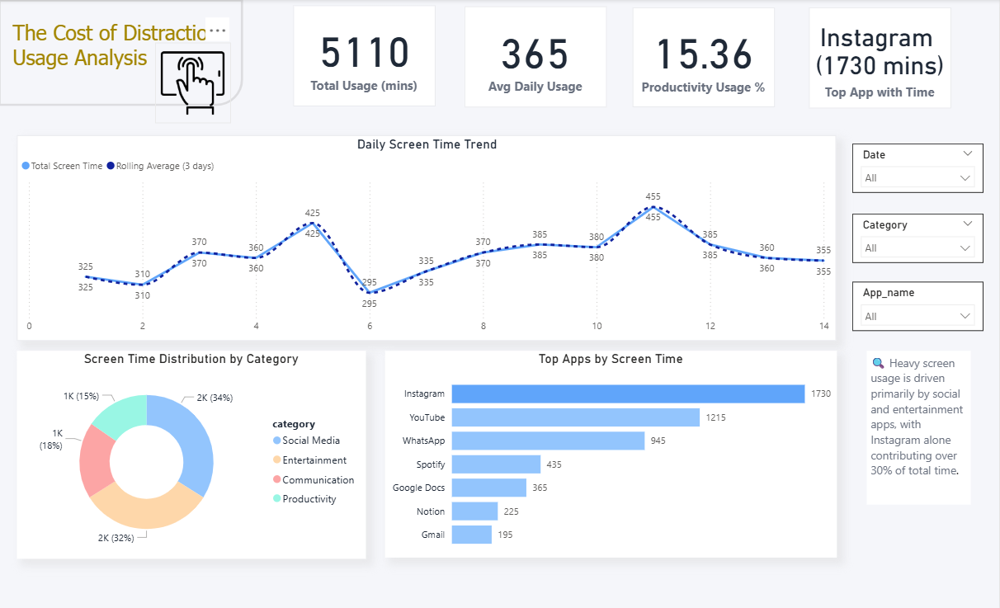
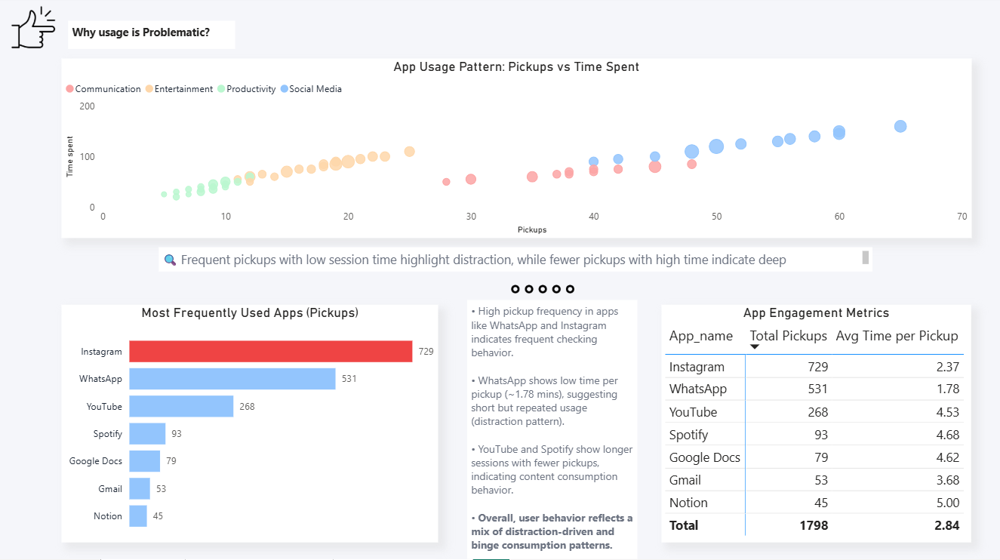
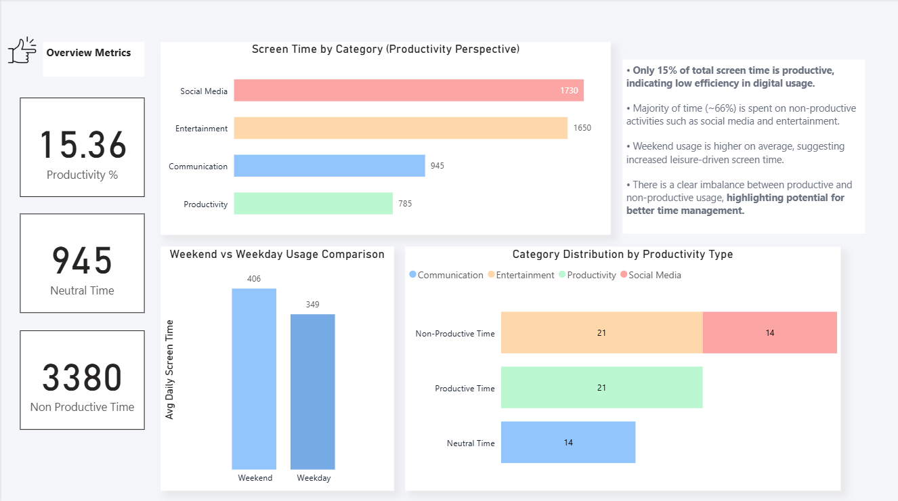

# Digital-usage-productivity-analysis

# Digital Usage & Productivity Analysis

*(The Cost of Distraction: A Behavioral Study)*

---

##  Project Overview

This project analyzes personal digital usage patterns to understand how time is spent across different applications and its impact on productivity.

The goal is to:

* Identify high-usage and high-distraction apps
* Analyze behavioral patterns like frequent pickups
* Measure productivity vs non-productive time
* Provide actionable insights for better time management

---

##  Tools & Technologies

* SQL (Data Analysis)
* Power BI (Data Visualization & Dashboarding)
* Excel (Data Cleaning & Preparation)

---

##  Dataset

The dataset contains app-level usage data including:

* Date
* App Name
* Category
* Time Spent (minutes)
* Pickups (number of times app opened)
* Notifications
* Productivity Classification (Yes / No / Neutral)

---

##  Key KPIs

* Total Screen Time: **5110 minutes**
* Avg Daily Usage: **365 minutes (~6 hrs/day)**
* Productivity Rate: **15.36%**
* Most Used App: **Instagram (1730 minutes)**

---

##  Dashboard Overview

### 🟦 1. Overview

* Daily screen time trend (with rolling average)
* Category-wise usage distribution
* Top apps by usage

 Insight:
Majority of usage is concentrated in social media and entertainment apps.

---

### 🟪 2. Behavior & Engagement

* Scatter plot (Pickups vs Time Spent)
* App engagement metrics
* Most frequently opened apps

 Insight:
Apps like Instagram and WhatsApp show high pickup frequency, indicating frequent interruptions and distraction patterns.

---

### 🟩 3. Productivity Insights

* Productive vs Non-Productive usage
* Category distribution by productivity type
* Weekend vs Weekday comparison

 Insight:
Only ~15% of total time is productive, with most usage driven by non-productive activities.

---

##  Key Insights

* High pickup frequency leads to fragmented attention
* Social media and entertainment dominate screen time
* Significant gap between productive and non-productive usage
* Weekend usage is higher, indicating leisure-driven behavior

---

##  Limitations

* Limited dataset (short time period)
* Productivity classification is rule-based
* Based on single-user data (not generalizable)

---

##  Future Improvements

* Incorporate real-time data sources
* Develop a more dynamic productivity scoring model
* Expand analysis across multiple users
* Add predictive analytics for behavior patterns

---

## Dashboard Preview

### Overview

### Behavior & Engagement

### Productivity Insights

---

##  Conclusion

This project demonstrates how raw usage data can be transformed into meaningful insights that highlight behavioral patterns, identify inefficiencies, and support better decision-making.

---

## Author

Ritu Thakur

---
